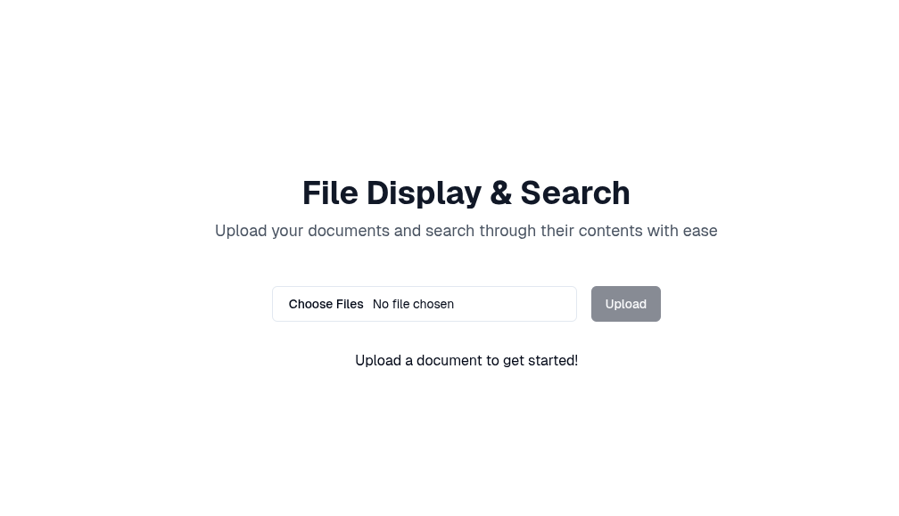
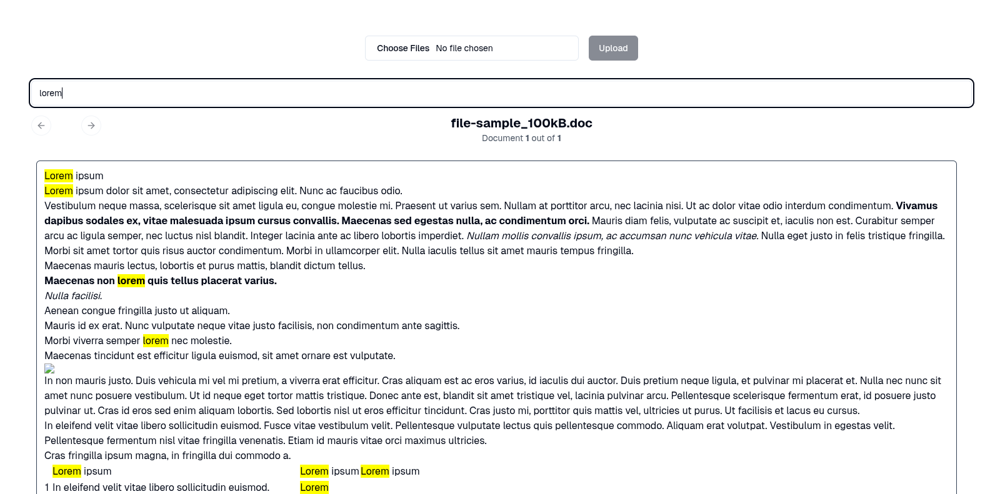

# McCarren Coding challenge

This is a coding challenge created for an assignment from McCarren AI. The challenge is to create a simple web application that allows users to upload files and then display them with support for keyword search.

## Table of contents

- [McCarren Coding challenge](#mccarren-coding-challenge)
  - [Table of contents](#table-of-contents)
  - [Running the application](#running-the-application)
  - [How to use the application](#how-to-use-the-application)
  - [Technologies used](#technologies-used)
- [Deployment](#deployment)

## Running the application

For this project, `pnpm` was used as the package manager. To run the application, you need to have `pnpm` installed. If you don't have it installed, you can install it by running the following command:

```bash
npm install -g pnpm
```

After installing `pnpm`, you can run the following commands to install the dependencies run the application:

```bash
pnpm install
pnpm dev
```

## How to use the application

After running the application, you can access it by visiting `http://localhost:3000` in your browser. You will see a simple form that allows to choose and upload files, as shown below:



You will be able to upload `.doc`, `.docx`, `.pdf`, and `.xlsx` files. After uploading the files, the application will extract the text from the files and display them in a carousel. You can search for a specific keyword by typing it in the search box, as shown below:



The search will filter the files based on the keyword you entered, and the found matches within the files will be highlighted. The search is case-insensitive.

## Technologies used

As requested, the application uses Next.js with JavaScript and vercel for deployment. Besides that, the following technologies were used:

- [Tailwind CSS](https://tailwindcss.com/): for styling the application with ease.
- [shadcn-ui](https://ui.shadcn.com/): as a UI library for a consistent design.
- [mammoth](https://www.npmjs.com/package/mammoth): for extracting text from the uploaded `.docx` files.
- [PDF.js](https://mozilla.github.io/pdf.js/): for extracting the text of the uploaded `.pdf` files.
- [SheetJS](https://sheetjs.com/): for extracting the text of the uploaded `.xlsx` files.
- [ConvertAPI](https://www.convertapi.com/): for converting the uploaded `.doc` files to `.docx` files, as there didn't seem to be a reliable way to extract text from `.doc` files directly on JavaScript (I'm using the free tier, with a 250 uploads limit).
- [use-debounce](https://www.npmjs.com/package/use-debounce): for debouncing the search input to avoid searching on every keystroke.
- [Vercel Blob Storage](https://vercel.com/docs/storage/vercel-blob): for storing the uploaded files.

It is worth mentioning that, ideally, the application should be able to render all the uploaded files more reliably, instead of merely extracting text and a bit of formatting through HTML transformations. Initially, my idea was to use [@cyntler/react-doc-viewer](https://github.com/cyntler/react-doc-viewer), as it is able to render all the supported file types. However, it uses external resources such as embedded iframes from Word and Excel online, in which I would not be able to implement the search functionality. I decided to go with the current approach to meet the keyword search requirements of the challenge.

The UI is fully responsive, which was easy thanks to Tailwind CSS and shadcn-ui.

# Deployment

The application is deployed on Vercel, and you can access it [here](https://file-keyword-searcher.vercel.app/).
